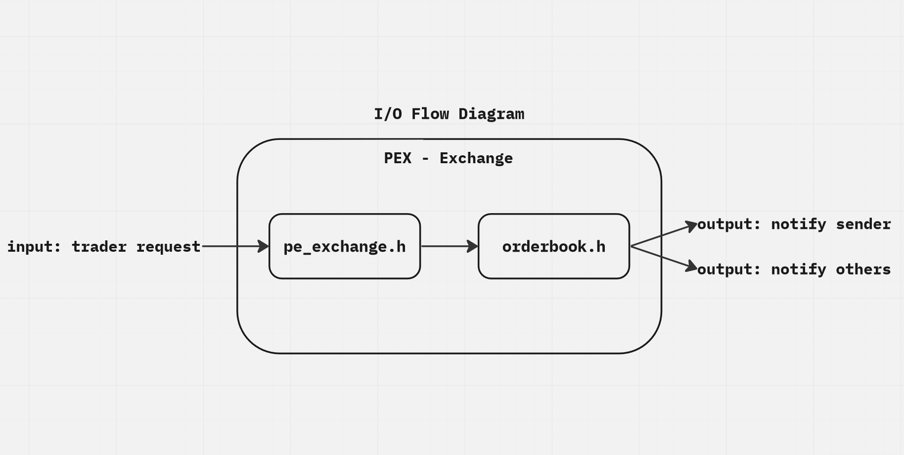
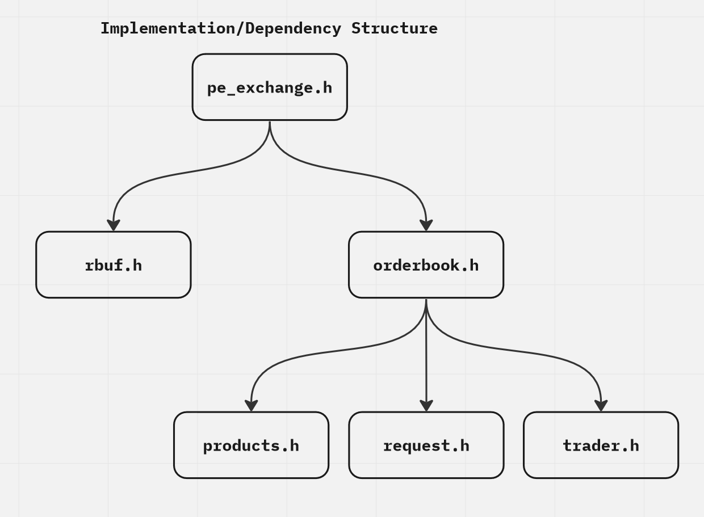

1. Describe how your exchange works.

PEX exchange consists of two main modules, ``pe_exchange`` and ``orderbook``. The module ``pe_exchange`` is responsible 
for dealing with input (trader message/requests) parsing and validation, whereas  ``orderbook`` is responsible with 
order execution, matching, orderbook printing and output (trader notification). It uses the ``epoll`` module for multiplexing.

The ``orderbook`` module consists of 3 sub_modules: ``product_t``, ``request_t``, ``trader_t``. Each encapsulate data
that are passed around and handled by struct ``orderbook_t``, with ``product_t`` being the most crucial component.
The ``pe_exchange`` module utilises a ring buffer from ``rbuf.h`` to queue PID from signals.

Inside ``product.h``, it uses ``pqueue_t``, a doubly-linked linked list based ring priority queue, ranked by price
(highest first). After an order is validated and parsed as ``request_t``, the order is executed first through order
matching (BUY/SELL) and if exists a remainder, that will be enqueued into the product's ``pqueue_t``. During this 
procedure, messages are sent to the relevant traders, updating the variables in their ``trader_t`` structs. 

2. Describe your design decisions for the trader and how it's fault-tolerant.

In ``pe_trader``, a global variable is implemented to track the PID of the recentmost signal received. Thus, 
``sigaction`` was used to enable this handling. After it receives a ``MARKET OPEN;`` message from the exchange,
it waits until a ``MARKET SELL ...`` message from the exchange, where it will request a buy order
to the exchange. ``pe_trader`` disconnects when ``qty >= 1000``. 

To ensure it is fault tolerant, two measures were put in place:
- If multiple messages stack, trader will only read until a semicolon delimiter.
- SIGUSR1 must be received from ``ppid`` (exchange).
- It will keep pinging SIGUSR1 back to the exchange after writing
  to the pipe (every 250ms), until it receives a SIGUSR1 response
  from the exchange.

Hence, ``read_msg(int fd, char *buf, int buflen, char delim)`` is implemented to deal with message stacking,
and ``pause_until_response(int ppid)`` and ``signal_until_response(int ppid, int sig)`` are implemented to
deal with rogue and missed signals.

3. Describe your tests and how to run them.

To run the tests, the binaries ``pe_exchange``, ``pe_trader``, and the tests must be compiled.
Simply use the command ``make`` and ``make tests`` to generate the binaries. Afterwards, the
command ``make run_tests`` is used to run the testcases.

Unit tests (Uses CMocka):
- ``orderbook_test.c``: tests ``orderbook`` module
- ``product_test.c``: tests ``product`` module
- ``rbuf_test.c``: tests ``rbuf`` module
- ``request_test.c``: tests ``request`` module
- ``trader_test.c``: tests ``trader`` module
E2E tests (Test Trader Binaries)
- ``test_autotrader``: Second trader to be run in conjunction with ``pe_trader``
